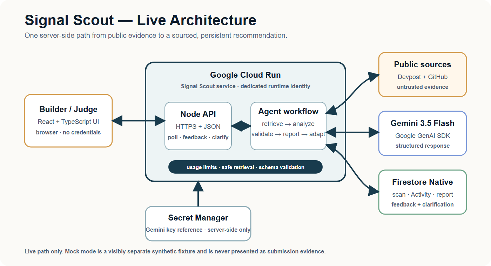

# Signal Scout

> **Current verified status (20 August 2026):** Signal Scout is publicly deployed on Cloud Run revision `signal-scout-00016-c9x` from product commit `8307d80`. The final golden workflow, evidence package, honest partial state, and explicit failure state are preserved at repository checkpoint `6bd3027`. Current golden proof scan: `c3c0f521-0b3d-41ea-855d-83a42db22df8`.

Signal Scout turns a hackathon and a builder's goals into a sourced field analysis, strategic project gaps, a learning shortlist, and an actionable build plan, while preserving a visible trace of every source and processing step.

```text
official Devpost URL + builder context + optional public GitHub project URLs
  -> retrieve -> extract -> validate -> compare -> rank
  -> generate Field Report -> expose Activity and evidence
  -> adapt one sourced recommendation from explicit feedback
```

## Hackathon alignment

- Event: [All Things Agentic Hackathon](https://allthingsagentichackathon.devpost.com/)
- Category: **The Collaborative Partner**
- Required stack: Gemini 3.5+ through a qualifying Google agent framework and at least one Google Cloud infrastructure service
- Implemented stack: Gemini 3.5 Flash, Google GenAI SDK, Cloud Run, and Firestore Native
- Public verified deployment: https://signal-scout-212660130578.australia-southeast1.run.app
- Public repository: https://github.com/SkillSpringAI/Signal-Scout

The live path is the submission workflow. The deterministic mock is visibly labelled and exists only for tests, offline development, and a no-cost product orientation.

## Submission essentials

| Requirement | Signal Scout evidence |
|---|---|
| Spin-up instructions | Follow [Install and verify](#install-and-verify), then choose the deterministic Mock path or the Live local path below. Cloud deployment guidance is under [Container and Cloud Run](#container-and-cloud-run). |
| Architecture diagram | The diagram below explicitly connects the React frontend, Cloud Run backend, public sources, Gemini 3.5 Flash, Firestore, and Secret Manager. A [portable PNG](docs/architecture-diagram.png), [SVG](docs/architecture-diagram.svg), and [annotated architecture page](docs/architecture-diagram.md) are included. |
| Demonstration video | Final video must be public, no longer than four minutes, explain the problem and value proposition, show the application working end to end, and visibly prove the backend is running on Google Cloud. |

## Architecture at a glance



The browser receives structured results only. Retrieval, Gemini calls, validation, persistence, capacity checks, and credentials remain in the Cloud Run backend. The [architecture notes](docs/architecture-diagram.md) document the trust boundaries and prototype limitation without crowding the submission diagram.

## Prerequisites

- Node.js 22.x and npm 10+
- A Gemini API key for live-local mode
- Application Default Credentials and a Firestore Native database only when testing Firestore mode

Do not place API keys, service-account JSON, or ADC contents in the repository, browser, screenshots, or demo video.

## Install and verify

From a clean checkout:

```bash
npm ci
npm run preflight
```

`preflight` runs the TypeScript checks, complete Vitest suite, client production build, and server compilation.

## Run the deterministic mock

```bash
npm run dev
```

Open the local Vite URL, leave **Execution** set to **Mock demo**, and run the guided fixture. All mock projects, people, scores, signals, findings, and memory are synthetic and must not be used as submission evidence.

## Run the live workflow locally

1. Copy `.env.example` to `.env` without committing it.
2. Set `GEMINI_API_KEY` to a server-side key.
3. Keep `SCAN_STORE=memory` for an ephemeral local run, or set `SCAN_STORE=firestore` and configure Application Default Credentials.
4. Build and start the combined production UI/API:

```bash
npm run build
npm start
```

5. Verify `http://localhost:8080/api/health` returns:

```json
{ "ok": true, "service": "signal-scout-api" }
```

6. Open `http://localhost:8080`, select **Live scan**, and use a public Devpost event page plus optional public GitHub project URLs.

The default public-demo policy allows Devpost event hosts and GitHub project hosts, limits one request to one event plus five project URLs, permits 50 scan/retry/feedback actions per UTC day, and applies a three-action-per-client burst limit over ten minutes. Limits and host lists are configurable through `.env.example`. HTTP `429 DEMO_CAPACITY_REACHED` is an intentional safe state.

## Container and Cloud Run

Build the same multi-stage Node 22 image used by Cloud Run:

```bash
docker build -t signal-scout .
docker run --rm -p 8080:8080 --env-file .env signal-scout
```

For Cloud Run:

- set `SCAN_STORE=firestore`;
- use a dedicated runtime service account with only required Firestore and Secret Manager access;
- mount `GEMINI_API_KEY` from Secret Manager rather than a literal environment value;
- retain minimum instances `0` and maximum instances `2`;
- configure the demo usage and allowed-host variables from `.env.example`;
- verify the health route, one complete event-plus-project scan, one feedback turn, Firestore persistence, and error-severity logs after deployment.

The exact verified commands, revisions, identities, and proof jobs are recorded in [Gate 2 runtime guide](docs/gate-2-runtime.md). Never copy credentials or unrelated Firestore records into deployment evidence.

## Demonstration video checklist

- Keep the public YouTube or Vimeo video at **four minutes or less**.
- Briefly explain the problem, target builder, and value proposition.
- Show one unedited Live scan through sourced evidence, Field Report, feedback adaptation, and clarification recording.
- Visibly prove the backend is on Google Cloud using the public `.run.app` URL and a sanitized Cloud Run revision/traffic view.
- Exclude credentials, secret values, billing identifiers, unrelated Firestore records, and private browser/account details.

## Public API

- `POST /api/scans` — create a bounded scan
- `GET /api/scans/:id` — poll persisted state
- `POST /api/scans/:id/cancel` — request cancellation
- `POST /api/scans/:id/retry-analysis` — use the one preserved-source analysis retry when applicable
- `POST /api/scans/:id/feedback` — apply the one bounded feedback turn
- `POST /api/scans/:id/clarification` — persist one answer to the generated clarification without another model call

The client receives structured jobs and source evidence, never Gemini or Google Cloud credentials. Capacity guards return HTTP `429`, `Retry-After`, and `{ "error": "DEMO_CAPACITY_REACHED", "message": "..." }`.

## Known prototype limits

- Scan execution begins process-locally with `setImmediate`; completed and partial Firestore records are durable, but an in-flight job is not automatically resumed after container interruption.
- The public deployment is a bounded hackathon demo, not a production multi-tenant service or general crawler.
- Only one analysis retry and one feedback adaptation are permitted per applicable scan.
- Six moderate transitive `uuid` advisories currently arrive through Firebase Admin dependencies. The offered automated fix crosses a breaking Firebase Admin downgrade, so the risk is documented rather than force-fixed before the demo.
- Mock permission modes are presentational outside their explicitly tested mock-memory boundary.

## Authoritative project documents

- [Hackathon execution plan](docs/hackathon-execution-plan.md)
- [Submission compliance](docs/submission-compliance.md)
- [Architecture](docs/architecture.md) and [diagram](docs/architecture-diagram.md)
- [Demo evidence ledger](docs/demo-evidence-ledger.md)
- [Gate 2 runtime guide](docs/gate-2-runtime.md)
- [Safety and permissions](docs/safety-and-permissions.md)
- [Prior-work disclosure](docs/prior-work-disclosure.md)

Official Devpost requirements override repository notes. Organizer emails are retained separately as supplementary guidance and do not replace the official overview or rules.

## License

Signal Scout is available under the [MIT License](LICENSE). Copyright (c) 2026 Isac Thompson.
