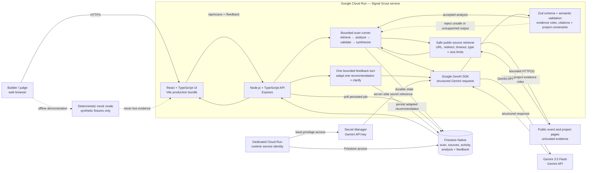

# Signal Scout Architecture Diagram

> **Submission artifact:** verified against Cloud Run revision `signal-scout-00007-vb6` on 14 August 2026. Maintain this diagram when implemented component boundaries or data flows change. Copy, prompt, styling, and other non-architectural corrections do not require a diagram revision.

## Trust and evidence boundaries

- Credentials remain server-side. Cloud Run receives the Gemini key through a Secret Manager reference granted only to the dedicated runtime identity.
- Retrieved pages are untrusted input. The retriever enforces public HTTP/HTTPS, redirect, timeout, content-type, and size boundaries before content reaches Gemini.
- Event and project sources retain distinct evidence roles. Event pages establish requirements and judging criteria; project pages establish current implementation state.
- Gemini output is accepted only after structured schema and semantic validation. Unsupported project-state claims and citations outside the collected source set are rejected.
- Firestore persists scan state, source metadata, Activity events, validated analysis, and the single bounded feedback result.
- Mock mode is deterministic, synthetic, and visibly separate from the live evidence path.

## Prototype limitation

Scan execution is started process-locally. Completed and partial records are durable in Firestore, but an in-flight job is not automatically resumed if its Cloud Run container stops.
