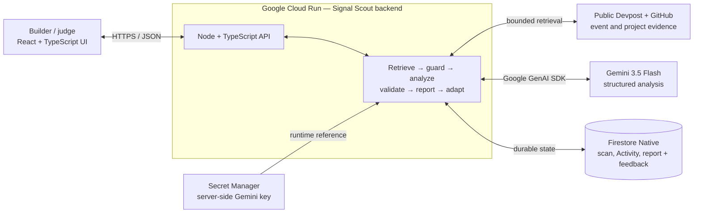

# Signal Scout Architecture Diagram

> **Submission artifact:** simplified for judge readability and verified against Cloud Run revision `signal-scout-00016-c9x` on 20 August 2026.

Portable submission files: [architecture-diagram.png](architecture-diagram.png) and [architecture-diagram.svg](architecture-diagram.svg). Keep the compact Mermaid source below aligned with both files.

## Trust and evidence boundaries

- Credentials remain server-side. Cloud Run receives the Gemini key through a Secret Manager reference granted only to the dedicated runtime identity.
- Retrieved pages are untrusted input. The retriever enforces public HTTP/HTTPS, redirect, timeout, content-type, and size boundaries before content reaches Gemini.
- The public demo reserves capacity before scan, retry, or feedback work. Firestore provides the durable daily counter; a small process-local burst window dampens rapid repeated requests.
- Event sources are restricted to configured Devpost hosts and project sources to configured GitHub hosts in the deployed demo. Every redirect and DNS resolution is rechecked.
- Event and project sources retain distinct evidence roles. Event pages establish requirements and judging criteria; project pages establish current implementation state.
- Gemini output is accepted only after structured schema and semantic validation. Unsupported project-state claims and citations outside the collected source set are rejected.
- Firestore persists scan state, source metadata, Activity events, validated analysis, the single bounded feedback result, and one builder clarification response.
- Mock mode is deterministic, synthetic, and visibly separate from the live evidence path.

## Prototype limitation

Scan execution is started process-locally. Completed and partial records are durable in Firestore, but an in-flight job is not automatically resumed if its Cloud Run container stops.
